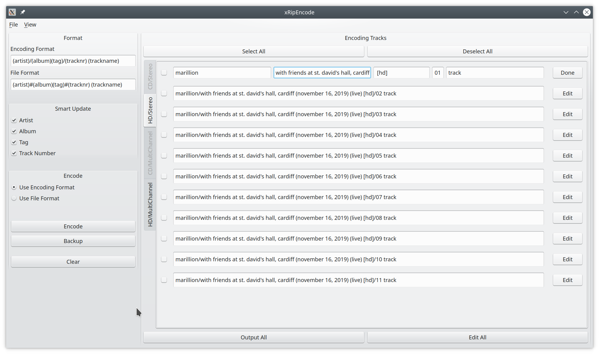
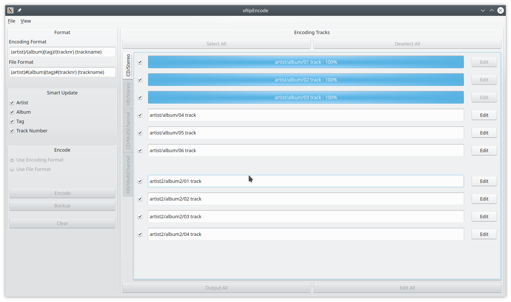

# xRipEncode

## Overview

xRipEncode is a ripper/encoding tool with two ripper and one encoding view. The audio CD view implements 
a simple CD ripper whith audio CD lookup for artist, album and track names using MusicBrainz. The second
view is a movie file ripper that can split movie files into tracks (chapters) and extract the audio 
stream of each track. The output of the two ripper views can be encoded as flac or wavpack file using the
encoding view.

## Audio CD View

The main screen of the audio CD view is simple audio CD ripper. Any audio CD in the system is detected 
when pushing the *Detect* button. An automatic musicbrainz lookup is performed. This lookup can be repeated
pressing the *Lookup* button. One easily switch in between multiple musicbrainz results using the combo box.
If no result is available the *Autofill* button will populate artist, album and track names with generic names.
The two checkboxes allow the manipulation of the musicbrainz results. The offset box is useful for multiple CD
set. The given offset is added to the track number used in file name of the output. Select the tracks you want 
to rip (or use the *Select All* button) press *Rip Selected* in order to start a thread that rips the selected 
audio tracks. The rip thread can be stopped using the *Cancel Rip* button. Afterward the *Eject* button can 
be used to eject the audio CD.

## Movie File View

The main screen of the movie file view is a ripper for movie files. The files can be split (using *mkvmerge*) into 
tracks which are usually represented by the chapters. The file can be selected using the file dialog that is 
opened by pressing the *...* button next to the filename box. Pressing the *Analyze* button will use *ffprobe*
to analyze the movie file. The chapter and audio stream information is displayed. The *Autofill* button is used to
fill the artist, album and track names with generic names. 
Select the audio streams and movie tracks you want to extract and then press *Rip Selected* to split up the movie
file and extract the selected audio streams. This extraction process is running in a separate thread.

## Encoding View

The main screen of the movie file view allows for easy encoding of the output created by the audio CD and the 
movie file view. The tags for each file can be modified. The selected format (encoding, file) decides the file 
name of the encoded output. The output is encoded as flac file if you press the *Encode* button and encoded as 
wavpack file if the *Backup* button is pressed. All tracks of the current tab are removed if the *Clear* button
is pressed.

## Known Issues

While the tool is functional it is currently unstable in case of error or corner cases.

## Requirements

* Qt 5.x
* C++17
* MusicBrainzCC
* libcdio
* mkvtools
* ffmpeg and ffprobe

